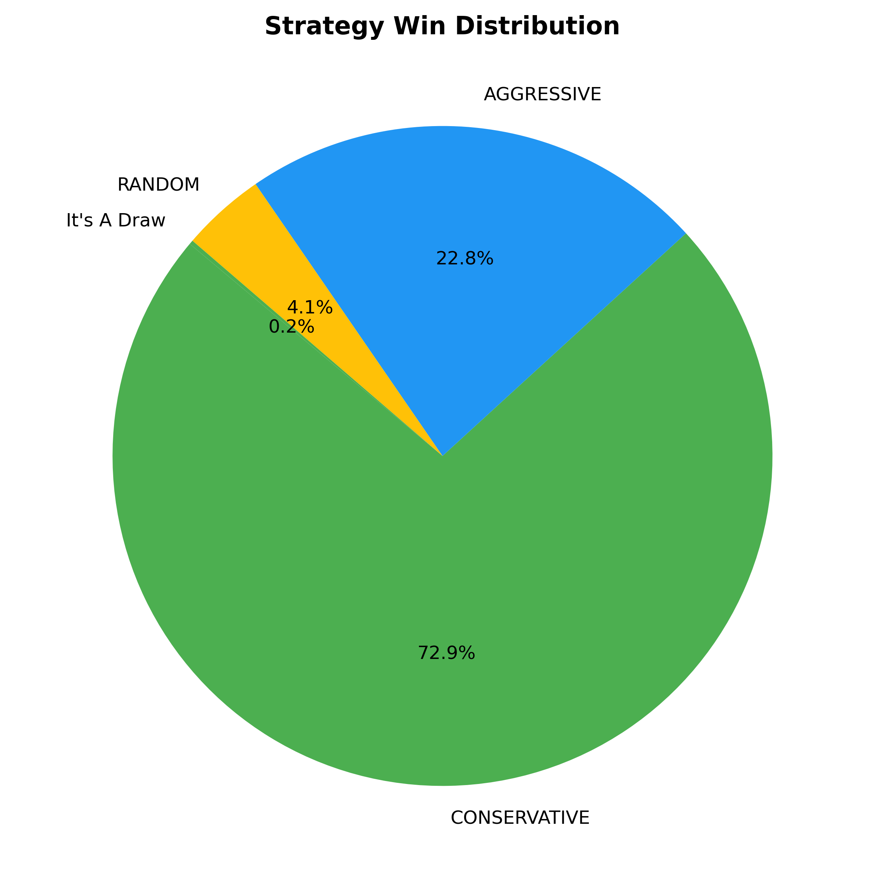
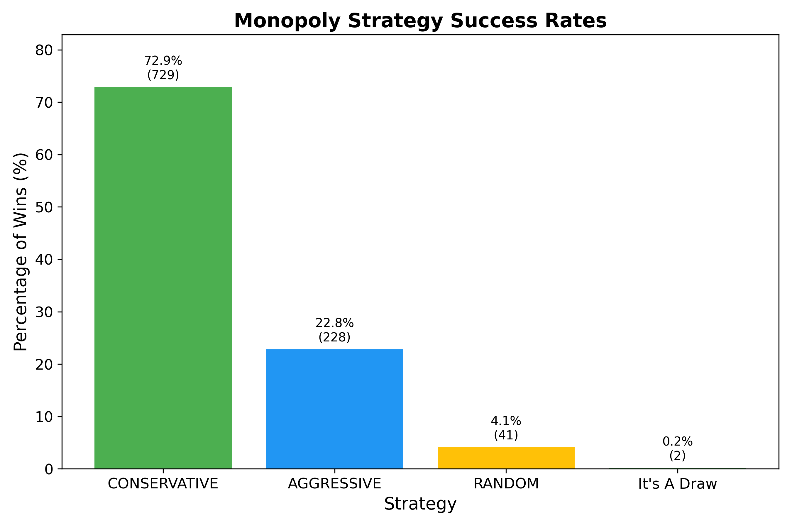

# 🧠 Monopoly Strategy Simulator

This project simulates 1,000+ games of Monopoly to compare player strategies (Aggressive, Conservative, Random). I used Django to store the results, a simple API to expose them, and React to display the insights. I also used Python and matplotlib to generate graphs.

---

## 🔧 Backend Setup (Django)

```bash
# Clone the repo and go into the backend folder
git clone https://github.com/YOUR_USERNAME/monopoly-strategy-simulator.git
cd monopoly-strategy-simulator/monopoly_backend

# Set up virtual environment
python3 -m venv venv
source venv/bin/activate  # (on Windows: venv\Scripts\activate)

# Install backend packages
pip install -r requirements.txt

# Load the JSON data into the database
python load_results.py

# Run the server
python manage.py runserver
```

---

## 💻 Frontend Setup (React)

```bash
# Go to the frontend folder
cd ../frontend

# Install dependencies
npm install

# Run the React app
npm run dev
```

---

## 📊 Visualizations

### Win Percentage by Strategy


---

### Average Wins by Strategy


---

### Summary Insight
//

---

## 🤓 Tools Used

- Python
- Django
- React
- matplotlib

---

## ✨ Extra Notes

- You can expand the project by adding more strategies or building live graphs into the frontend.
- Deployment-ready once you're ready to push to Render (backend) and Netlify or Vercel (frontend).
